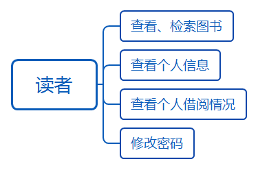
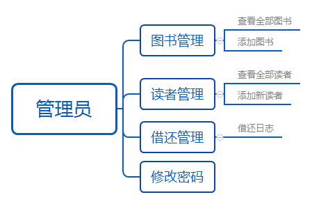
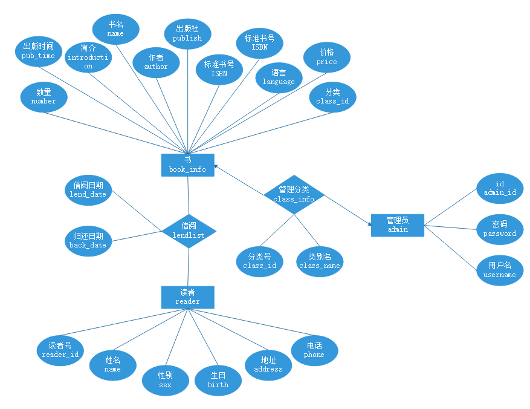
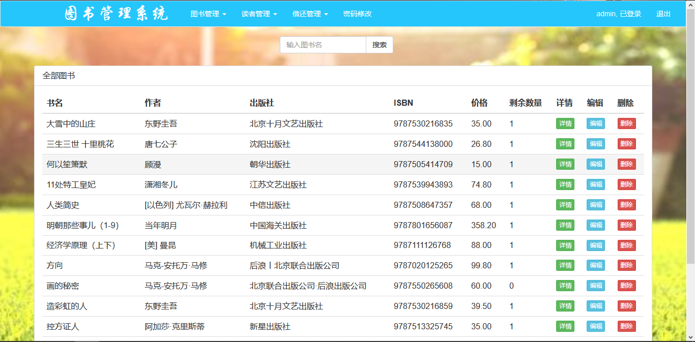

# 图书馆管理系统

### 概述
基于Spring + Spring MVC + MyBatis的图书馆管理系统，使用Maven进行包管理。主要功能包括：图书查询、图书管理、图书编辑、读者管理、图书的借阅与归还以及借还日志记录等。

### 环境配置
#### 开发环境：Windows 10，IntelliJ IDEA 2018.3
#### 运行配置
1. 首先安装Mysql8.0，设置用户名为root，密码为wuhuai12，并保证其在运行状态，并执行library.sql文件导入数据。
2. 然后再配置Maven到环境变量中，在源代码目录下运行
```sh
# mvn jetty:run
```
3. 使用浏览器访问http://localhost:8080即可进入系统。

### 概念设计
用户分为两类：读者、图书馆管理员。图书馆管理员可以修改读者信息，修改书目信息，查看所有借还日志等；读者仅可以修改个人信息、借阅或归还书籍和查看自己的借还日志。


#### 数据库E-R图


### 逻辑设计
共有6个表：

#### 1. 图书书目表book_info
| 名           | 类型    | 长度 | 小数点 | NULL | 用途     | 键   |
| :----------- | :------ | ---- | ------ | ---- | -------- | ---- |
| book_id      | bigint  | 20   | 0      | 否   | 图书号   | ✔    |
| name         | varchar | 20   | 0      | 否   | 书名     |      |
| author       | varchar | 15   | 0      | 否   | 作者     |      |
| publish      | varchar | 20   | 0      | 否   | 出版社   |      |
| ISBN         | varchar | 15   | 0      | 否   | 标准书号 |      |
| introduction | text    | 0    | 0      | 是   | 简介     |      |
| language     | varchar | 4    | 0      | 否   | 语言     |      |
| price        | decimal | 10   | 2      | 否   | 价格     |      |
| pub_date     | date    | 0    | 0      | 否   | 出版时间 |      |
| class_id     | int     | 11   | 0      | 是   | 分类号   |      |
| number       | int     | 11   | 0      | 是   | 剩余数量 |      |

#### 2. 数据库管理员表admin
| 名       | 类型    | 长度 | 小数点 | NULL | 用途   | 键   |
| :------- | :------ | ---- | ------ | ---- | ------ | ---- |
| admin_id | bigint  | 20   | 0      | 否   | 账号   | ✔    |
| password | varchar | 15   | 0      | 否   | 密码   |      |
| username | varchar | 15   | 0      | 是   | 用户名 |      |

#### 3. 图书分类表class_info
| 名         | 类型    | 长度 | 小数点 | NULL | 用途   | 键   |
| :--------- | :------ | ---- | ------ | ---- | ------ | ---- |
| class_id   | int     | 11   | 0      | 否   | 类别号 | ✔    |
| class_name | varchar | 15   | 0      | 否   | 类别名 |      |

#### 4. 借阅信息表lend_list
| 名        | 类型   | 长度 | 小数点 | NULL | 用途     | 键   |
| :-------- | :----- | ---- | ------ | ---- | -------- | ---- |
| ser_num   | bigint | 20   | 0      | 否   | 流水号   | ✔    |
| book_id   | bigint | 20   | 0      | 否   | 图书号   |      |
| reader_id | bigint | 20   | 0      | 否   | 读者证号 |      |
| lend_date | date   | 0    | 0      | 是   | 借出日期 |      |
| back_date | date   | 0    | 0      | 是   | 归还日期 |      |

#### 5. 借阅卡信息表reader_card
| 名        | 类型    | 长度 | 小数点 | NULL | 用途     | 键   |
| :-------- | :------ | ---- | ------ | ---- | -------- | ---- |
| reader_id | bigint  | 20   | 0      | 否   | 读者证号 | ✔    |
| password  | varchar | 15   | 0      | 否   | 密码     |      |
| username  | varchar | 15   | 0      | 是   | 用户名   |      |

#### 6. 读者信息表reader_info
| 名        | 类型    | 长度 | 小数点 | NULL | 用途     | 键   |
| :-------- | :------ | ---- | ------ | ---- | -------- | ---- |
| reader_id | bigint  | 20   | 0      | 否   | 读者证号 | ✔    |
| name      | varchar | 10   | 0      | 否   | 姓名     |      |
| sex       | varchar | 2    | 0      | 否   | 性别     |      |
| birth     | date    | 0    | 0      | 否   | 生日     |      |
| address   | varchar | 50   | 0      | 否   | 地址     |      |
| phone     | varchar | 15   | 0      | 否   | 电话     |      |

### 功能展示
#### 1.	首页登陆
管理者账号：123456/123456
读者账号：10000/123456


#### 2.	管理员系统
用登陆进入
##### 2.1 图书管理



